# 第三章，分类

## 本章知识点

- 分类的基本方法。已经一些常用的类。
- 怎么评价一个分类系统。这里主要还是正类和负类这些概念。
    - 精度， 
    - 召回率
    - ROC

- 一些应用
    - 多标签分类
    - 清晰图片(利用多输出)

## 基本

```python
from sklearn.linear_model import SGDClassifier
%matplotlib inline 
def sort_by_target(mnist):
    reorder_train = np.array(sorted([(target, i) for i, target in enumerate(mnist.target[:60000])]))[:, 1]
    reorder_test = np.array(sorted([(target, i) for i, target in enumerate(mnist.target[60000:])]))[:, 1]
    mnist.data[:60000] = mnist.data[reorder_train]
    mnist.target[:60000] = mnist.target[reorder_train]
    mnist.data[60000:] = mnist.data[reorder_test + 60000]
    mnist.target[60000:] = mnist.target[reorder_test + 60000]
```


```python
from sklearn.datasets import fetch_openml
import numpy as np

mnist = fetch_openml('mnist_784', version=1, cache=True, data_home="./../sklearn")
mnist.target = mnist.target.astype(np.int8)
sort_by_target(mnist)
mnist["data"],mnist["target"]
```


    (array([[0., 0., 0., ..., 0., 0., 0.],
            [0., 0., 0., ..., 0., 0., 0.],
            [0., 0., 0., ..., 0., 0., 0.],
            ...,
            [0., 0., 0., ..., 0., 0., 0.],
            [0., 0., 0., ..., 0., 0., 0.],
            [0., 0., 0., ..., 0., 0., 0.]]),
     array([0, 0, 0, ..., 9, 9, 9], dtype=int8))


这里就是把数据进行了分组。
- X：特征
- y：目标


```python
X, y = mnist["data"], mnist["target"]
X.shape
X_train, x_test, y_train, y_test = X[:60000], X[60000:], y[:60000], y[60000:]

import numpy as np
shuffle_index = np.random.permutation(60000)
X_train, y_train = X_train[shuffle_index], y_train[shuffle_index]
```


```python
X_train[:5]
```


    array([[0., 0., 0., ..., 0., 0., 0.],
           [0., 0., 0., ..., 0., 0., 0.],
           [0., 0., 0., ..., 0., 0., 0.],
           [0., 0., 0., ..., 0., 0., 0.],
           [0., 0., 0., ..., 0., 0., 0.]])


这个函数，本质上来说，就是把东西拼接数组，组成一个比较大的数组。然后打印那个数组。  

计算机的图片就是一个一个像素点。而一个train set的中的单元，逻辑上来说是一张一张图片，而实现上来说，只是像素点组合成的数组。
而下面这个函数，就是把这些像素点组成的数组拼装起来。


```python
# EXTRA
def plot_digits(instances, images_per_row=10, **options):
    size = 28
    images_per_row = min(len(instances), images_per_row)
    images = [instance.reshape(size,size) for instance in instances]
    n_rows = (len(instances) - 1) // images_per_row + 1
    row_images = []
    n_empty = n_rows * images_per_row - len(instances)
    images.append(np.zeros((size, size * n_empty)))
    for row in range(n_rows):
        rimages = images[row * images_per_row : (row + 1) * images_per_row]
        row_images.append(np.concatenate(rimages, axis=1))
    image = np.concatenate(row_images, axis=0)
    plt.imshow(image, cmap = matplotlib.cm.binary, **options)
    plt.axis("off")
```


```python
import matplotlib
import matplotlib.pyplot as plt

plot_digits(X_train[:5])
plt.show()
```


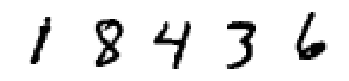


```python
y_train[:5]
```


    array([1, 8, 4, 3, 6], dtype=int8)


```python
%matplotlib inline 

five_example = mnist["data"][36000]
image = five_example.reshape(28, 28)
plt.axis("off")
plt.imshow(image, cmap=matplotlib.cm.binary, interpolation="nearest")
plt.show()
```


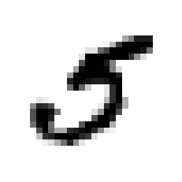


mnist 数据的类型，就是把一张图片，拍平成一个数组。然后对数组进行对比。


```python
"每个元素的类型，本质上来说是，{}".format(type(five_example))
```


    "每个元素的类型，本质上来说是，<class 'numpy.ndarray'>"


```python
sgd_clf = SGDClassifier(random_state=42, max_iter=5, tol=-np.infty)
y_train_5 = (y_train == 5)
y_test_5 = (y_test == 5)

        
sgd_clf.fit(X_train, y_train_5)
sgd_clf.predict([five_example])
```


    array([ True])


下面是交叉验证。


```python
from sklearn.model_selection import StratifiedKFold
from sklearn.base import  clone
skfolds = StratifiedKFold(n_splits=3, random_state=42,shuffle=True)

for train_index,test_index in skfolds.split(X_train,y_train_5):
    clone_clf= clone(sgd_clf)
    x_train_folds = X_train[train_index]
    y_train_folds = y_train_5[train_index]
    x_test_fold = X_train[test_index]
    y_test_fold = y_train_5[test_index]
    
    clone_clf.fit(x_train_folds,y_train_folds)
    y_pred = clone_clf.predict(x_test_fold)
    
    n_correct = sum(y_pred == y_test_fold)
    
    print("correct is {}".format(n_correct/len(y_pred)))
```

    correct is 0.964
    correct is 0.9658
    correct is 0.96575


下面的两个模型，一个是正经的干活，一个是唯一答案。然后发觉两者其实结果差不多的。  

从另一个角度，其实AI本质还是一个找寻概率的问题。找寻概率高的那个，而有时候，猜比较大概率那个也是一种省力的办法。这里的问题还是有点神奇的。

如果以现在的只是来看。这里的工作也就高出了5%左右的正确率。。。


```python

from sklearn.model_selection import cross_val_score
cross_val_score(sgd_clf,X_train,y_train_5,cv=3,scoring="accuracy")
```


    array([0.95785, 0.95735, 0.96065])


```python
from sklearn.base import BaseEstimator

class Never5Classifier(BaseEstimator):
    def fit(self,x,y=None):
        pass
    def predict(self,x):
        return np.zeros((len(x),1),dtype=bool) # return all 5

never_5_clf = Never5Classifier()
cross_val_score(never_5_clf,X_train,y_train_5,cv=3,scoring="accuracy")
```


    array([0.91165, 0.90635, 0.91095])


```python
from sklearn.model_selection import cross_val_predict
y_train_pred = cross_val_predict(sgd_clf,X_train,y_train_5,cv=3)
y_train_pred
```


    array([False, False, False, ..., False, False, False])


这个是一个比对的结果

|     说明        |  模型判断为非         | 模型判断为负  |
| :-------------  | :----------:        |  -----------: |
|  负类           | 真负类（非5 认为非5）  | 假正类（非5非认为5）    |
|  正类           | 假负类（为5，认为5非）  | 真正类（为5，认为5） |


```python
from sklearn.metrics import confusion_matrix
matrix = confusion_matrix(y_train_5,y_train_pred)
matrix
```


    array([[53836,   743],
           [ 1740,  3681]])


```python
from sklearn.metrics import precision_score,recall_score,f1_score
precision = precision_score(y_train_5,y_train_pred)
recall= recall_score(y_train_5,y_train_pred)
f1 = f1_score(y_train_5,y_train_pred)
"precision score is {}, recall score is {}, f1 score is {}".format(precision,recall,f1)

```


    'precision score is 0.8320524412296564, recall score is 0.6790260099612617, f1 score is 0.7477907567293042'


- 精度：一堆里面，找出来的是准确度高. 结果里面的**杂质**会更加少。
- 召回率： 一堆满足的里面，能够召回几个。正确的结果**漏掉**会更加少


打个比方：100个球，10个红的，90个黑的。找红球

精度，追求的是我找到找到的球红色的多。那么最好的策略，就是去少找球。因为相同的概率下，找的次数越多，黑球出现的概率就越大。
极端情况下，我找一个，只要那个是红球。那么精度就是100%。  

召回率，追求的红球的数量越多，或者说剩余的球里面红球越少。那么我必须要找10次。因为有是个球。但是概率的原因，10个球里面必然有一个黑球。
那么我就要找11次。召回率越高，我的找寻次数就越少。


```python
TP = matrix[1,1]
FP = matrix[0,1]
FN = matrix[1,0]
precision = TP/(TP+FP)
recall = TP/(TP+FN)
f1 = TP/(TP+(FN+FP)/2)
"precision score is {}, recall score is {}, f1 score is {}".format(precision,recall,f1)

```


    'precision score is 0.8320524412296564, recall score is 0.6790260099612617, f1 score is 0.7477907567293042'


下面这个，就是自己做比较。具体我还是不太清楚了。估计和算法了解相关。  
发觉到了这里，整体来说就比较好理解了。

至少对于`SGDClassifier`这个算法来说。之后的流程，就是把数据按照相似度来排序。而阀值本质就是用来作为相关度的**最小值**。  
而算这个相似度算法的，的精度和召回率，就是这个算法的衡量指标。对于业余的来说，就是一个**黑盒**。

天下没有完美的算法，造成了这个相似度*计算失误*，也就是造成了那么多问题在那里。


```python
y_scores_simple = sgd_clf.decision_function(X_train)
y_scores_simple.shape
```


    (60000,)


```python
y_scores = cross_val_predict(sgd_clf,X_train,y_train_5,cv=3,method="decision_function")
y_scores
```


    array([-346619.07669367, -359827.15235574, -240220.18913702, ...,
           -288042.44377112, -218689.36241251, -123522.76954389])


```python
from sklearn.metrics import precision_recall_curve
precisions,recalls,thresholds = precision_recall_curve(y_train_5,y_scores)

def plot_precision_recall_vs_threadhold(precisions,recalls,thresholds):
    plt.plot(thresholds,precisions[:-1],"b--",label="Precision")
    plt.plot(thresholds,recalls[:-1],"g--",label="Recalll")
    plt.xlabel("Threadhold")
    plt.legend(loc="upper left")
    plt.ylim([0,1])

plot_precision_recall_vs_threadhold(precisions,recalls,thresholds)
plt.show()
```


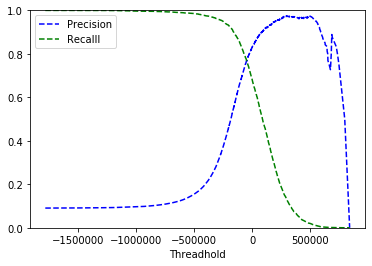


```python
from sklearn.metrics import roc_curve
fpr,tpr,thresholds = roc_curve(y_train_5,y_scores)

def plot_roc_curve(fpr,tpr,label=None):
    plt.plot(fpr,tpr,linewidth=2,label=label)
    plt.plot([0,1],[0,1],'k--')
    plt.axis([0,1,0,1])
    plt.xlabel('False Positive Rate')
    plt.ylabel('True Positive Rate')

plot_roc_curve(fpr,tpr)
plt.show()
```


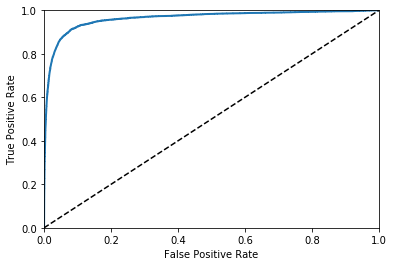


fpr(假正类率）：混入正类的假概率。分母是负类的综合，在负类中占的概率。

下面的这张图，其实就是为了防止假负类率，所以就阿猫阿狗全都进如选择。最后导致，负类内选取的数量不断提高。最后全部选进来了。


```python
from sklearn.metrics import roc_auc_score
roc_auc_score(y_train_5,y_scores)
```


    0.9631429840420016


随机森林方法


```python
from sklearn.ensemble import RandomForestClassifier

forest_clf = RandomForestClassifier(random_state=42)
y_probas_forest = cross_val_predict(forest_clf,X_train,y_train_5,cv=3,method="predict_proba")
```


```python
y_scores_forest = y_probas_forest[:,1]
fpr_forest,tpr_forest,thresholds_forest = roc_curve(y_train_5,y_scores_forest)
plt.plot(fpr,tpr,"b:",label="SGD")
plot_roc_curve(fpr_forest,tpr_forest,"Random Forest")
plt.legend(loc="lower right")
plt.show()
```


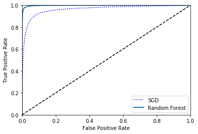


下面这个明显变慢了。因为他要自动生成好几个分类器。

OvO: One vs One, 需要训练数据少，但是分类器多。  
OvR: One vs Rest 相反

这个区别其实挺好理解的。因为OvO就是两个比对。但是OvR则是群体比对。  
不过我不清楚Ovo是怎么选择最后谁胜出的。因为这个还是有点神奇的。


```python
sgd_clf.fit(X_train, y_train)
```


    SGDClassifier(alpha=0.0001, average=False, class_weight=None,
                  early_stopping=False, epsilon=0.1, eta0=0.0, fit_intercept=True,
                  l1_ratio=0.15, learning_rate='optimal', loss='hinge', max_iter=5,
                  n_iter_no_change=5, n_jobs=None, penalty='l2', power_t=0.5,
                  random_state=42, shuffle=True, tol=-inf, validation_fraction=0.1,
                  verbose=0, warm_start=False)


```python
five_example = X[36000]
sgd_clf.predict([five_example])
```


    array([5], dtype=int8)


```python
example_score = sgd_clf.decision_function([five_example])
example_score
```


    array([[-186187.22206198, -499252.47910277, -532164.9628503 ,
            -138744.48854563, -380359.99423409,    1565.2959146 ,
            -807259.94536181, -405828.30948682, -537732.26537638,
            -524809.2249553 ]])


```python
np.argmax(example_score)
```


    5


```python
"""
目标的列表，估计是列表的真实值吧。
"""
sgd_clf.classes_ 
```


    array([0, 1, 2, 3, 4, 5, 6, 7, 8, 9], dtype=int8)


```python
from sklearn.multiclass import OneVsOneClassifier

ovo_clf = OneVsOneClassifier(SGDClassifier(random_state=42, max_iter=5, tol=-np.infty))
ovo_clf.fit(X_train,y_train)
ovo_clf.predict([five_example])
```


    array([5], dtype=int8)


```python
len(ovo_clf.estimators_)
```


    45


```python
forest_clf.fit(X_train,y_train)
forest_clf.predict([five_example])
```


    array([5], dtype=int8)


```python
forest_clf.predict_proba([five_example])
```


    array([[0.  , 0.01, 0.  , 0.09, 0.03, 0.84, 0.  , 0.02, 0.  , 0.01]])


```python
cross_val_score(sgd_clf,X_train,y_train,cv=3,scoring="accuracy")
```


    array([0.86375, 0.8609 , 0.8819 ])


```python
from sklearn.preprocessing import StandardScaler
scaler = StandardScaler()
X_train_scaled = scaler.fit_transform(X_train.astype(np.float64))

cross_val_score(sgd_clf,X_train_scaled,y_train,cv=3,scoring="accuracy")

```


    array([0.91275, 0.90705, 0.9107 ])


所有的交叉，就是把数据分类n份，然后做n次。  
每次都把一个给弄出来，用其他来做训练，来评估他。  
最后返回一个整体


```python
from functools import partial

my_score = partial(cross_val_score,cv=3,scoring="accuracy")
my_score(sgd_clf,X_train_scaled,y_train)

```


    array([0.91275, 0.90705, 0.9107 ])


## 错误分析


```python
y_train_pred = cross_val_predict(sgd_clf,X_train_scaled,y_train,cv=3)
conf_mx = confusion_matrix(y_train,y_train_pred)
conf_mx
```


    array([[5736,    2,   21,   11,   12,   48,   41,    9,   41,    2],
           [   2, 6511,   43,   22,    6,   32,    7,   12,   98,    9],
           [  54,   39, 5317,   99,   84,   26,  104,   56,  165,   14],
           [  45,   48,  143, 5339,    2,  227,   35,   53,  141,   98],
           [  21,   31,   42,    8, 5378,    8,   48,   32,   85,  189],
           [  71,   47,   35,  181,   77, 4614,  109,   27,  168,   92],
           [  35,   27,   44,    3,   45,   87, 5625,    5,   46,    1],
           [  27,   27,   73,   27,   56,   12,    7, 5819,   18,  199],
           [  49,  165,   74,  145,   14,  160,   54,   33, 5035,  122],
           [  41,   42,   26,   84,  181,   40,    2,  209,   88, 5236]])


这张图，数字越小。表示就越黑。白的地方，反而表示正确率越高。


```python
plt.matshow(conf_mx,cmap=plt.cm.gray)
```


    <matplotlib.image.AxesImage at 0x7fd709063f90>


下面的处理，做的是一个反处理。算百分比。这个百分比是错误率。  
因为除了对角线之外,其他都是错误的。就是错误数据的百分比。这个百分比越高，值越大，就会显示越白。

其实这里比较难以理解的是，对角线是正确率。其他都是错误率


```python
row_sums = conf_mx.sum(axis=1,keepdims=True)
norm_conf_mx = conf_mx/row_sums
norm_conf_mx
```


    array([[9.68428161e-01, 3.37666723e-04, 3.54550059e-03, 1.85716698e-03,
            2.02600034e-03, 8.10400135e-03, 6.92216782e-03, 1.51950025e-03,
            6.92216782e-03, 3.37666723e-04],
           [2.96647879e-04, 9.65737170e-01, 6.37792940e-03, 3.26312667e-03,
            8.89943637e-04, 4.74636606e-03, 1.03826758e-03, 1.77988727e-03,
            1.45357461e-02, 1.33491546e-03],
           [9.06344411e-03, 6.54582075e-03, 8.92413562e-01, 1.66163142e-02,
            1.40986908e-02, 4.36388050e-03, 1.74555220e-02, 9.39912722e-03,
            2.76938570e-02, 2.34978181e-03],
           [7.33974882e-03, 7.82906541e-03, 2.33240907e-02, 8.70820421e-01,
            3.26211059e-04, 3.70249551e-02, 5.70869352e-03, 8.64459305e-03,
            2.29978796e-02, 1.59843419e-02],
           [3.59465936e-03, 5.30640192e-03, 7.18931873e-03, 1.36939404e-03,
            9.20575145e-01, 1.36939404e-03, 8.21636426e-03, 5.47757617e-03,
            1.45498117e-02, 3.23519343e-02],
           [1.30972145e-02, 8.66998709e-03, 6.45637336e-03, 3.33886737e-02,
            1.42040214e-02, 8.51134477e-01, 2.01069913e-02, 4.98063088e-03,
            3.09905921e-02, 1.69710386e-02],
           [5.91416019e-03, 4.56235215e-03, 7.43494424e-03, 5.06928016e-04,
            7.60392024e-03, 1.47009125e-02, 9.50490030e-01, 8.44880027e-04,
            7.77289625e-03, 1.68976005e-04],
           [4.30965682e-03, 4.30965682e-03, 1.16520351e-02, 4.30965682e-03,
            8.93854749e-03, 1.91540303e-03, 1.11731844e-03, 9.28810854e-01,
            2.87310455e-03, 3.17637670e-02],
           [8.37463681e-03, 2.82003076e-02, 1.26474107e-02, 2.47820885e-02,
            2.39275338e-03, 2.73457529e-02, 9.22919159e-03, 5.64006153e-03,
            8.60536660e-01, 2.08511366e-02],
           [6.89191461e-03, 7.06001009e-03, 4.37048243e-03, 1.41200202e-02,
            3.04252816e-02, 6.72381913e-03, 3.36190956e-04, 3.51319550e-02,
            1.47924021e-02, 8.80147924e-01]])


```python
plt.matshow(norm_conf_mx,cmap=plt.cm.gray)
```


    <matplotlib.image.AxesImage at 0x7fd65800dcd0>


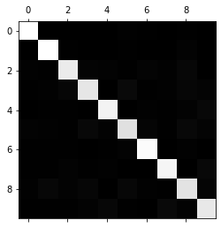


```python
np.fill_diagonal(norm_conf_mx,0) #如果不知空，那么其他都是值太小
plt.matshow(norm_conf_mx,cmap=plt.cm.gray)
```


    <matplotlib.image.AxesImage at 0x7fd719f2abd0>


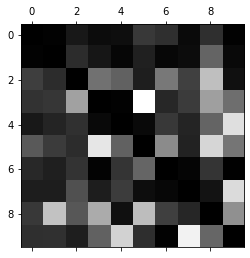


```python
cl_a,cl_b = 7,9
X_aa = X_train[(y_train==cl_a) & (y_train_pred == cl_a)]
X_ab = X_train[(y_train==cl_a) & (y_train_pred == cl_b)]
X_ba = X_train[(y_train==cl_b) & (y_train_pred == cl_a)]
X_bb = X_train[(y_train==cl_b) & (y_train_pred == cl_b)]
plt.figure(figsize=(8,8))
plt.subplot(221);plot_digits(X_aa[:25],images_per_row=5) # 3的真正类
plt.subplot(222);plot_digits(X_ab[:25],images_per_row=5) # 3的假正类
plt.subplot(223);plot_digits(X_ba[:25],images_per_row=5) # 5的假真类
plt.subplot(224);plot_digits(X_bb[:25],images_per_row=5) # 5的真真类
plt.show()
```


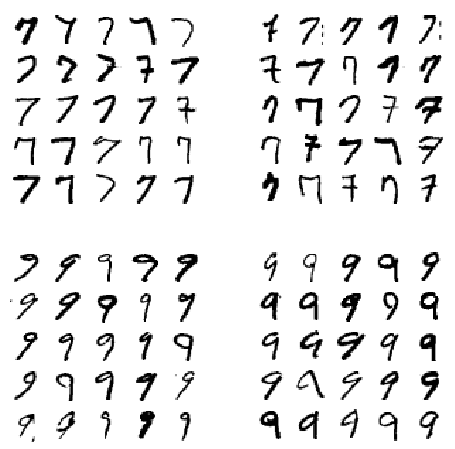


## 多标签分类
一个数据加上两个标签


```python
from sklearn.neighbors import KNeighborsClassifier

y_train_large = (y_train >= 7)
y_train_odd = (y_train % 2 == 1)
y_multilabel = np.c_[y_train_large, y_train_odd]

knn_clf = KNeighborsClassifier()
knn_clf.fit(X_train, y_multilabel)
```


    KNeighborsClassifier(algorithm='auto', leaf_size=30, metric='minkowski',
                         metric_params=None, n_jobs=None, n_neighbors=5, p=2,
                         weights='uniform')


```python
knn_clf.predict([five_example])
```


    array([[False,  True]])


下面这个很慢。


```python
#y_train_knn_pred = cross_val_predict(knn_clf,X_train,y_train,cv=3)
#f1_score(y_train,y_train_knn_pred,average="marcro")
```

## 多输出分类 

这里是输出和输入都是多标签。

就这里的例子来说。他做了这么几步
1. 给数据集加上噪音。
2. 把原始的数据，当成目标集合。也就是输出的集合。

预测结果，就是一副图片（784个像素组成的图片）

有噪音的图片 --》 干净的图片


```python
noise = np.random.randint(0, 100, (len(X_train), 784))
X_train_mod = X_train + noise
noise = np.random.randint(0, 100, (len(x_test), 784))
X_test_mod = x_test + noise
y_train_mod = X_train
y_test_mod = x_test
```


```python
def plot_digit(digit):
    image = digit.reshape(28, 28)
    plt.axis("off")
    plt.imshow(image, cmap=matplotlib.cm.binary, interpolation="nearest")
    plt.show()


some_index = 5500
plt.subplot(121);plot_digit(X_test_mod[some_index])
plt.subplot(122);plot_digit(x_test[some_index])
```


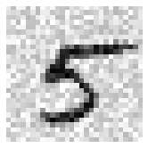


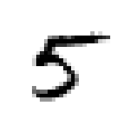


```python
knn_clf.fit(X_train_mod,y_train_mod)
clean_digit = knn_clf.predict([X_test_mod[some_index]])
plot_digit(clean_digit)

```


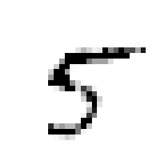

