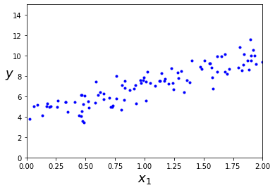
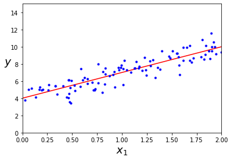
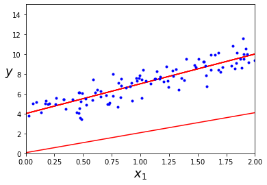
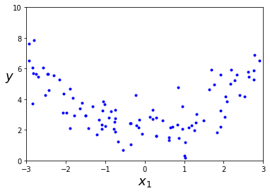
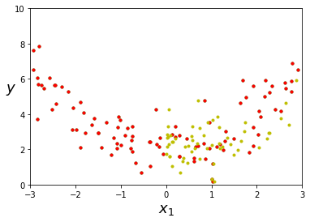
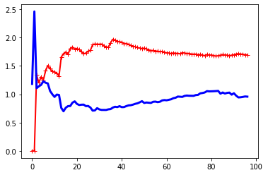
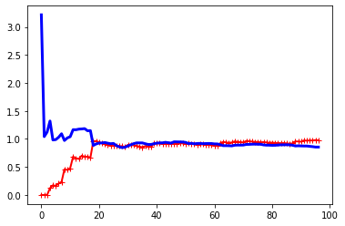
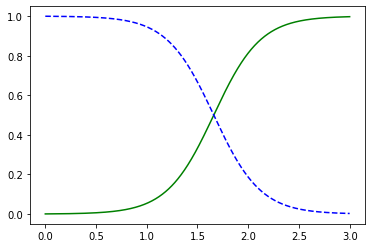

## 总结

- 这一章，公式其实已经介于看得懂与看不懂之间了。
- 看的懂的
    - 成本函数函数： 其实这只是一个落脚点，让你来评判模型好坏的一个立足点。
        - 有些成本函数的最小值可以算出来。比如线性回归。
        - 有些则不能，可以用梯度下降算法。
    - 所以这里面展示的公式，要么是成本函数，要么是成本函数的导数，为了让你明白怎么算。
    - 很多公式，本质都是矩阵运算。
    - 这些公式的图形
 - 看不懂的：这些公式怎么推导出来的。
 
## linear regression

首先，说点完全看不懂的吧。就是最前面的公式推导。为什么最后下面的公式，我是完全看不懂。
因为这些涉及的都是一些矩阵的运算。这个我看的云里雾里。

- 这些都是线性代数的表达。$y=4*x_0+3*x_1$

$\begin{bmatrix}3 & 4\end{bmatrix}*\begin{bmatrix}x_0 & x_1\end{bmatrix}$

- 这里的成本函数，其实我还不是太理解。我开始以为，只是简单的做了一个线性拟合。其实其他来讲，就是在处理线性拟合。
    - MSE(方差)：这个实践中，用的最多。
    - RMSE(均方根差)：
    - 从统计学上来说，MSE最小，就是穿过的划的线和实际的点之间的距离差最小。
    - 然后这里，是一个性能指标。而这个**性能最好**，就表示，**成本最低**
- `theta_best`这个是求出来的成本函数。但是这里就是一条线，串起来所有点的方案。
- `X`：其实这里，求的$x_1$
- `X_b`: 是如下的矩阵。$\begin{bmatrix}x_0 & x_1\end{bmatrix}$，然后$x_0$,永远是1


```python
import numpy as np


X = 2 * np.random.rand(100,1)
y = 4 + 3 * X + np.random.randn(100,1)

X_b = np.c_[np.ones((100,1)),X]

theta_best = np.linalg.inv(X_b.T.dot(X_b)).dot(X_b.T).dot(y)
theta_best
```


    array([[4.00744294],
           [2.99593247]])


```python
import matplotlib.pyplot as plt

plt.plot(X,y,"b.")
plt.xlabel("$X_1$")
plt.ylabel("$y$")
plt.xlabel("$x_1$", fontsize=18)
plt.ylabel("$y$", rotation=0, fontsize=18)
plt.axis([0, 2, 0, 15])
plt.show()
```





```python
X_new = np.array([[0],[2]])
X_new_b = np.c_[np.ones((2,1)),X_new]
y_predict = X_new_b.dot(theta_best)
y_predict
```


    array([[4.00744294],
           [9.99930788]])


```python
plt.plot(X_new,y_predict,"r-")
plt.plot(X,y,"b.")
plt.xlabel("$X_1$")
plt.ylabel("$y$")
plt.xlabel("$x_1$", fontsize=18)
plt.ylabel("$y$", rotation=0, fontsize=18)
plt.axis([0, 2, 0, 15])
plt.show()
```





```python
from sklearn.linear_model import LinearRegression
lin_reg = LinearRegression()
lin_reg.fit(X,y)
lin_reg.intercept_,lin_reg.coef_
```


    (array([4.00744294]), array([[2.99593247]]))


## 梯度

关于梯度，简单的来说，就是越接近最低点。那么其数据就越小。这个具体的展开，最好看看高数。这里展开其实没有太大的意义的。

就程序层面说，我总结了以下几点

- 所有的公式的推导都是黑盒。拿来用就好
- 其实到这里，很多都是线性代数用的地方。
- numpy关于线性代数的api来弄

三个梯度下降的区别。
- 批量：用的全集
- 随机：随机挑一个数据点来算，可以用`SGDRegressor`
- 小批量： 随机挑几个。

用猜，其实也明白这些的区别在哪里了。
- 批量的**全**，但是**慢**，
- 随机的话**快**，但是容易产生**偏执**。就像是文中说的容易陷入局部最小值。
- 小批量**两者之间**

到底哪个好，我觉得看成本。至少到目前位置。我个人觉得，其实这个预测的本质，还是找方向，而不是找点。
所以来说很多东西就没有那么确定了。

核外的意思是数据集之外。

说道现在$\theta_0$和$\theta_1$。求的还是这些估算点之间的关系。也就是从x到y的方程。  
而成本函数，其实就是预测值和Y的差。

然后第一方法，就是通过数学公式算出来。

梯度下降则是通过方式试出来。三种方式，本质就是算每次的变化量的区别。


```python
def plot_views(x_arr=X,y_arr=y,theta_array=[],axis_config = [0, 2, 0, 15]):
    
    for theta_value in theta_array:
        x_value = np.array([[0],[2]])
        x_matrix = np.c_[np.ones((2,1)),X_new]
        y_value = x_matrix.dot(theta_value)
        plt.plot(x_value,y_value,"r-")
    plt.plot(x_arr,y_arr,"b.")
    plt.xlabel("$X_1$")
    plt.ylabel("$y$")
    plt.xlabel("$x_1$", fontsize=18)
    plt.ylabel("$y$", rotation=0, fontsize=18)
    plt.axis(axis_config)
    plt.show()
```


```python
eta = 0.1
n_iterations = 1000
m = 100

theta = np.random.randn(2,1)
thetas = []
for iterator in range(n_iterations):
    gradients = 2/m*X_b.T.dot(X_b.dot(theta)-y)
    theta = theta - eta*gradients
    if iterator % 200 == 0:
        thetas.append(theta)
    
theta
```


    array([[4.00744294],
           [2.99593247]])


```python
plot_views(theta_array= thetas)
```





## 多项式回归


```python
m = 100 
X = 6* np.random.rand(m,1)-3
y = 0.5* X**2 + 2 + np.random.randn(m,1)
plot_views(x_arr=X,y_arr=y,axis_config=[-3,3,0,10])
```





```python
from sklearn.preprocessing import PolynomialFeatures
ploy_features = PolynomialFeatures(degree=2,include_bias=False)
X_ploy = ploy_features.fit_transform(X)
```

下面的红色和绿色完全重合。其实这样也挺好理解的。因为本质来说，是列1，和列2.

然后这下一个cell也验证了我的理解。本质来说，其只是做了以下计算。

然后多项式，本质就是把多项式，变成**矩阵形式**的线性回归。


```python
plt.plot(X,y,"g.")
plt.plot(X_ploy[:,0],y,"r.")
plt.plot(X_ploy[:,1],y,"y.")
plt.xlabel("$X_1$")
plt.ylabel("$y$")
plt.xlabel("$x_1$", fontsize=18)
plt.ylabel("$y$", rotation=0, fontsize=18)
plt.axis([-3,3,0,10])
plt.show()
```





```python
X_ploy[:,0]**2 - X_ploy[:,1]
```


    array([0., 0., 0., 0., 0., 0., 0., 0., 0., 0., 0., 0., 0., 0., 0., 0., 0.,
           0., 0., 0., 0., 0., 0., 0., 0., 0., 0., 0., 0., 0., 0., 0., 0., 0.,
           0., 0., 0., 0., 0., 0., 0., 0., 0., 0., 0., 0., 0., 0., 0., 0., 0.,
           0., 0., 0., 0., 0., 0., 0., 0., 0., 0., 0., 0., 0., 0., 0., 0., 0.,
           0., 0., 0., 0., 0., 0., 0., 0., 0., 0., 0., 0., 0., 0., 0., 0., 0.,
           0., 0., 0., 0., 0., 0., 0., 0., 0., 0., 0., 0., 0., 0., 0.])


### PolynomialFeatures遭成特征爆炸

就书上的说法，我的理解是，n个特征，到d的degree的特征都来一遍。比如书中的例子$a^2,a^3,b^2,b^3$。
还会添加$ab,a^2b$这类，所有的项目，简单的说，就是所有的幂的数据都来一遍排列组合。

所以他也就加大了，特征之间的关系。有时候可以用这种方法来看看**特征之间的关系**

然后书上面的个数有点小错误。个数是$\frac{(n+d)!}{n!d!}$,具体解法，在[这个里面](https://blog.csdn.net/tsinghuahui/article/details/80229299)

简单来说，就是$1^{a_0}x_1^{a_1}x_2^{a_2}...x_n^{a_n}$

然后$a_0+a_1+a_2...+a_n = d $.

上面的组合有n个。后面的概率论的数据我就不知道了

# 学习曲线

1. PipeLine也能一个模型？
2， 发觉每次的图，差别还是挺大的。

蓝线是训练的误差。红线是测试的误差。这个不一样，就表示是否过度拟合。

也可以从侧面就可以看出，数据多少开始就不用数据了。

然后就是验证学习的方法。


```python
from sklearn.metrics import mean_squared_error
from sklearn.model_selection import train_test_split
def plot_learning_curves(model,X,y):
    X_train,X_val,y_train,y_val = train_test_split(X,y,test_size=2)
    train_errors, val_errors=[],[]
    for m in range(1,len(X_train)): 
        model.fit(X_train[:m],y_train[:m])
        y_train_predict = model.predict(X_train[:m])
        y_val_predict = model.predict(X_val)
        train_errors.append(mean_squared_error(y_train_predict,y_train[:m]))
        val_errors.append(mean_squared_error(y_val_predict,y_val))
    plt.plot(np.sqrt(train_errors),"r-+",linewidth=2,label="train")
    plt.plot(np.sqrt(val_errors),"b-",linewidth=3,label="val")
    
lin_reg = LinearRegression()
plot_learning_curves(lin_reg,X,y)
```





```python
from sklearn.pipeline import Pipeline
polynomial_regression = Pipeline((
    ("poly_feature",PolynomialFeatures(degree=2,include_bias=False)),
    ("sdg_reg",LinearRegression())
))

plot_learning_curves(polynomial_regression,X,y)
```





## 正则化线性模型

主要办法是为了减少过度的拟合。

书中的约束，就是让他进入成本函数。一旦进入成本函数。那么在拟合的时候，就会不得不考虑他的存在。

- 或者从另一个角度理解，就是这里是方差和偏差。通过**加大**方差，来减少**误差**。
- 下面，其实都是线性函数里面包层皮
-  `SGDRegressor`用 `penalty`

而成本是追求越来越小的。

- 惩罚函数：书中没讲，就是后面这些函数加上去的那些东西。然后那张图，四张图的变化，惩罚函数的变化。
- 对比图主要的目的，还是为了让你看出区别。因为右边的图，其实是偏差大的。因为选错了模型。但是通过正则，把其拉回来了。
- 是训练的时候用的。而验证的时候不用。

### 关于成本函数

又看了一些前面的一些内容，关于成本函数。我觉得怎么，错误成本？

这个还是真的挺难理解的。我觉得其实只是一个评判标准，这个值最小的时候，理论上还是最小的。

或者说，因为追求这个函数最小，就像成本一样，所以叫成本？


### 岭回归

英文名叫`l2`


```python
np.random.seed(42)
m = 20
X = 3 * np.random.rand(m, 1)
y = 1 + 0.5 * X + np.random.randn(m, 1) / 1.5
X_new = np.linspace(0, 3, 100).reshape(100, 1)
```


```python
from sklearn.linear_model import Ridge

"""
其实这里我
"""
ridge_reg = Ridge(alpha=1,solver="cholesky")
ridge_reg.fit(X,y)
ridge_reg.predict([[1.5]])
```


    array([[1.55071465]])


```python
from sklearn.linear_model import SGDRegressor
sgd_reg = SGDRegressor(penalty="l2")
sgd_reg.fit(X,y.ravel())

sgd_reg.predict([[1.5]])
```


    array([1.46543286])


### Lasso

会减小无关的特征。因为其惩罚函数的绝对值。如果无关。那么其势必会越来越小。

他会转换。


```python
from sklearn.linear_model import Lasso
lasso_reg = Lasso(alpha=0.1)
lasso_reg.fit(X,y)
lasso_reg.predict([[1.5]])
```


    array([1.53788174])


 
###弹性网络

上面的合体


```python
from sklearn.linear_model import ElasticNet

elastic_net = ElasticNet(alpha=0.1,l1_ratio=0.5)
elastic_net.fit(X,y)
elastic_net.predict([[1.5]])
```


    array([1.54333232])


### 早期停止法

就是停早期的停止

然后看了以下实现，发觉基本来说，有着对着图片在那里弄。怎么说好呢。如果连续的函数没有问题。
但是一些比较不规则的函数。

我觉得实际情况中，无非就是确定一个可以接受的范围，然后差不多到了这个范围，再寻找。


### 逻辑回归

第一遍的读的时候，感觉只是一个阀值的概念。逻辑函数的原因。


```python
from sklearn import datasets

iris = datasets.load_iris()
iris.keys()

```


    dict_keys(['data', 'target', 'target_names', 'DESCR', 'feature_names', 'filename'])


```python
print(iris.DESCR)

```

    .. _iris_dataset:
    
    Iris plants dataset
    --------------------
    
    **Data Set Characteristics:**
    
        :Number of Instances: 150 (50 in each of three classes)
        :Number of Attributes: 4 numeric, predictive attributes and the class
        :Attribute Information:
            - sepal length in cm
            - sepal width in cm
            - petal length in cm
            - petal width in cm
            - class:
                    - Iris-Setosa
                    - Iris-Versicolour
                    - Iris-Virginica
                    
        :Summary Statistics:
    
        ============== ==== ==== ======= ===== ====================
                        Min  Max   Mean    SD   Class Correlation
        ============== ==== ==== ======= ===== ====================
        sepal length:   4.3  7.9   5.84   0.83    0.7826
        sepal width:    2.0  4.4   3.05   0.43   -0.4194
        petal length:   1.0  6.9   3.76   1.76    0.9490  (high!)
        petal width:    0.1  2.5   1.20   0.76    0.9565  (high!)
        ============== ==== ==== ======= ===== ====================
    
        :Missing Attribute Values: None
        :Class Distribution: 33.3% for each of 3 classes.
        :Creator: R.A. Fisher
        :Donor: Michael Marshall (MARSHALL%PLU@io.arc.nasa.gov)
        :Date: July, 1988
    
    The famous Iris database, first used by Sir R.A. Fisher. The dataset is taken
    from Fisher's paper. Note that it's the same as in R, but not as in the UCI
    Machine Learning Repository, which has two wrong data points.
    
    This is perhaps the best known database to be found in the
    pattern recognition literature.  Fisher's paper is a classic in the field and
    is referenced frequently to this day.  (See Duda & Hart, for example.)  The
    data set contains 3 classes of 50 instances each, where each class refers to a
    type of iris plant.  One class is linearly separable from the other 2; the
    latter are NOT linearly separable from each other.
    
    .. topic:: References
    
       - Fisher, R.A. "The use of multiple measurements in taxonomic problems"
         Annual Eugenics, 7, Part II, 179-188 (1936); also in "Contributions to
         Mathematical Statistics" (John Wiley, NY, 1950).
       - Duda, R.O., & Hart, P.E. (1973) Pattern Classification and Scene Analysis.
         (Q327.D83) John Wiley & Sons.  ISBN 0-471-22361-1.  See page 218.
       - Dasarathy, B.V. (1980) "Nosing Around the Neighborhood: A New System
         Structure and Classification Rule for Recognition in Partially Exposed
         Environments".  IEEE Transactions on Pattern Analysis and Machine
         Intelligence, Vol. PAMI-2, No. 1, 67-71.
       - Gates, G.W. (1972) "The Reduced Nearest Neighbor Rule".  IEEE Transactions
         on Information Theory, May 1972, 431-433.
       - See also: 1988 MLC Proceedings, 54-64.  Cheeseman et al"s AUTOCLASS II
         conceptual clustering system finds 3 classes in the data.
       - Many, many more ...


```python
X = iris["data"][:,3:]
y = (iris["target"] == 2).astype(np.int)
X[:3]
```


    array([[0.2],
           [0.2],
           [0.2]])


```python
from sklearn.linear_model import LogisticRegression

log_reg = LogisticRegression()
log_reg.fit(X,y)
```


    LogisticRegression(C=1.0, class_weight=None, dual=False, fit_intercept=True,
                       intercept_scaling=1, l1_ratio=None, max_iter=100,
                       multi_class='auto', n_jobs=None, penalty='l2',
                       random_state=None, solver='lbfgs', tol=0.0001, verbose=0,
                       warm_start=False)


```python
X_new = np.linspace(0,3,1000).reshape(-1,1)
# 返回值是0和1的概率。这里可以做点人工计算
y_proba = log_reg.predict_proba(X_new)
plt.plot(X_new,y_proba[:,1],"g-",label="Iris-Virginica")
plt.plot(X_new,y_proba[:,0],"b--",label="Not Iris-Virginica")
plt.show()
```





### Softmax

其实就是上面一些的的多类。


```python
X = iris["data"][:,(2,3)]
y = iris["target"]

softmax_reg = LogisticRegression(multi_class="multinomial",solver="lbfgs",C=10)
softmax_reg.fit(X,y)
softmax_reg.predict([[5,2]])

```


    array([2])


```python
softmax_reg.predict_proba([[5,2]])

```


    array([[6.38014896e-07, 5.74929995e-02, 9.42506362e-01]])


